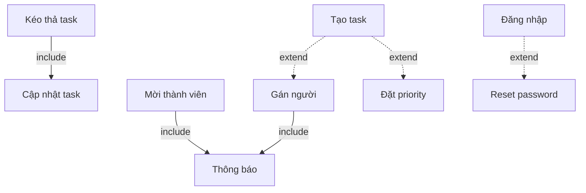

# Use Case Diagram - TasksCatt

> Project Management System (Mini Jira/Trello)

---

## 📊 Biểu đồ Use Case Tổng Quan

```mermaid
flowchart LR
    subgraph Actors["👥 Actors"]
        Guest["🧑 Khách"]
        User["👤 Người dùng"]
        Admin["🔧 Quản trị viên"]
    end

    subgraph Auth["🔐 Xác thực"]
        UC1(("Đăng ký"))
        UC2(("Đăng nhập"))
        UC3(("Đặt lại mật khẩu"))
        UC4(("Đăng xuất"))
    end

    subgraph Profile["👤 Hồ sơ"]
        UC5(("Xem hồ sơ"))
        UC6(("Cập nhật hồ sơ"))
        UC7(("Đổi mật khẩu"))
    end

    subgraph Projects["📁 Dự án"]
        UC8(("Tạo dự án"))
        UC9(("Xem danh sách dự án"))
        UC10(("Xem Kanban board"))
        UC11(("Cập nhật dự án"))
        UC12(("Xóa dự án"))
        UC13(("Mời thành viên"))
        UC14(("Phân quyền thành viên"))
        UC15(("Rời dự án"))
    end

    subgraph Columns["📋 Cột Kanban"]
        UC16(("Tạo cột"))
        UC17(("Cập nhật cột"))
        UC18(("Xóa cột"))
        UC19(("Sắp xếp cột"))
    end

    subgraph Tasks["✅ Tasks"]
        UC20(("Tạo task"))
        UC21(("Xem chi tiết task"))
        UC22(("Cập nhật task"))
        UC23(("Xóa task"))
        UC24(("Kéo thả task"))
        UC25(("Gán người thực hiện"))
        UC26(("Đặt priority/deadline"))
    end

    subgraph Comments["💬 Bình luận"]
        UC27(("Thêm bình luận"))
        UC28(("Sửa bình luận"))
        UC29(("Xóa bình luận"))
    end

    subgraph Search["🔍 Tìm kiếm"]
        UC30(("Tìm kiếm task"))
        UC31(("Lọc task"))
    end

    subgraph Realtime["🔔 Thông báo"]
        UC32(("Nhận thông báo"))
        UC33(("Xem activity log"))
    end

    subgraph AdminPanel["⚙️ Quản trị"]
        UC34(("Quản lý users"))
        UC35(("Block/Unblock user"))
    end

    %% Guest
    Guest --> UC1
    Guest --> UC2
    Guest --> UC3

    %% User (all features)
    User --> UC4
    User --> UC5
    User --> UC6
    User --> UC7
    User --> UC8
    User --> UC9
    User --> UC10
    User --> UC11
    User --> UC12
    User --> UC13
    User --> UC14
    User --> UC15
    User --> UC16
    User --> UC17
    User --> UC18
    User --> UC19
    User --> UC20
    User --> UC21
    User --> UC22
    User --> UC23
    User --> UC24
    User --> UC25
    User --> UC26
    User --> UC27
    User --> UC28
    User --> UC29
    User --> UC30
    User --> UC31
    User --> UC32
    User --> UC33

    %% Admin
    Admin --> UC34
    Admin --> UC35
```



---

## 👥 Actors (3)

| Actor | Mô tả |
|-------|-------|
| 🧑 **Khách** | Chưa đăng nhập, chỉ có thể đăng ký/đăng nhập |
| 👤 **Người dùng** | Đã đăng nhập, tham gia và làm việc trong projects |
| 🔧 **Quản trị viên** | Quản lý hệ thống, users |

---

## 🔑 MemberRole (Phân quyền trong Project)

> Không phải actors - đây là permission levels trong từng project

| Role | Quyền hạn |
|------|-----------|
| `VIEWER` | Chỉ xem tasks, comments |
| `MEMBER` | Tạo/sửa tasks, comments |
| `ADMIN` | Quản lý columns, members |
| `OWNER` | Toàn quyền, bao gồm xóa project |

```typescript
enum MemberRole {
  VIEWER = 'VIEWER',
  MEMBER = 'MEMBER', 
  ADMIN = 'ADMIN',
  OWNER = 'OWNER'
}
```

---

## 📋 Chi tiết Use Cases (35)

### 🔐 Xác thực (4)

| ID | Use Case | Actor | Mô tả |
|----|----------|-------|-------|
| UC1 | Đăng ký | Khách | Tạo tài khoản với email/password |
| UC2 | Đăng nhập | Khách | Xác thực, nhận JWT token |
| UC3 | Đặt lại mật khẩu | Khách | Reset password qua email |
| UC4 | Đăng xuất | Người dùng | Hủy phiên đăng nhập |

### 👤 Hồ sơ (3)

| ID | Use Case | Actor | Mô tả |
|----|----------|-------|-------|
| UC5 | Xem hồ sơ | Người dùng | Xem thông tin cá nhân |
| UC6 | Cập nhật hồ sơ | Người dùng | Sửa name, avatar |
| UC7 | Đổi mật khẩu | Người dùng | Thay đổi password |

### 📁 Dự án (8)

| ID | Use Case | Actor | Yêu cầu Role |
|----|----------|-------|--------------|
| UC8 | Tạo dự án | Người dùng | - (tự thành OWNER) |
| UC9 | Xem danh sách dự án | Người dùng | - |
| UC10 | Xem Kanban board | Người dùng | VIEWER+ |
| UC11 | Cập nhật dự án | Người dùng | ADMIN+ |
| UC12 | Xóa dự án | Người dùng | OWNER |
| UC13 | Mời thành viên | Người dùng | ADMIN+ |
| UC14 | Phân quyền thành viên | Người dùng | OWNER |
| UC15 | Rời dự án | Người dùng | VIEWER+ |

### 📋 Cột Kanban (4)

| ID | Use Case | Actor | Yêu cầu Role |
|----|----------|-------|--------------|
| UC16 | Tạo cột | Người dùng | ADMIN+ |
| UC17 | Cập nhật cột | Người dùng | ADMIN+ |
| UC18 | Xóa cột | Người dùng | ADMIN+ |
| UC19 | Sắp xếp cột | Người dùng | ADMIN+ |

### ✅ Tasks (7)

| ID | Use Case | Actor | Yêu cầu Role |
|----|----------|-------|--------------|
| UC20 | Tạo task | Người dùng | MEMBER+ |
| UC21 | Xem chi tiết task | Người dùng | VIEWER+ |
| UC22 | Cập nhật task | Người dùng | MEMBER+ |
| UC23 | Xóa task | Người dùng | ADMIN+ |
| UC24 | Kéo thả task | Người dùng | MEMBER+ |
| UC25 | Gán người thực hiện | Người dùng | MEMBER+ |
| UC26 | Đặt priority/deadline | Người dùng | MEMBER+ |

### 💬 Bình luận (3)

| ID | Use Case | Actor | Yêu cầu Role |
|----|----------|-------|--------------|
| UC27 | Thêm bình luận | Người dùng | MEMBER+ |
| UC28 | Sửa bình luận | Người dùng | MEMBER+ (chỉ của mình) |
| UC29 | Xóa bình luận | Người dùng | ADMIN+ hoặc owner comment |

### 🔍 Tìm kiếm (2)

| ID | Use Case | Actor | Yêu cầu Role |
|----|----------|-------|--------------|
| UC30 | Tìm kiếm task | Người dùng | VIEWER+ |
| UC31 | Lọc task | Người dùng | VIEWER+ |

### 🔔 Thông báo (2)

| ID | Use Case | Actor | Mô tả |
|----|----------|-------|-------|
| UC32 | Nhận thông báo | Người dùng | Real-time via Socket.io |
| UC33 | Xem activity log | Người dùng | Lịch sử hoạt động project |

### ⚙️ Quản trị (2)

| ID | Use Case | Actor | Mô tả |
|----|----------|-------|-------|
| UC34 | Quản lý users | Admin | CRUD users |
| UC35 | Block/Unblock user | Admin | Khóa/mở khóa tài khoản |

---

## 🔗 Quan hệ Use Cases



---

## 📈 Tổng kết

| Metric | Số lượng |
|--------|----------|
| **Actors** | 3 |
| **Use Cases** | 35 |
| **Modules** | 9 |
| **Member Roles** | 4 |

### So sánh với ban đầu:

| | Trước | Sau |
|--|-------|-----|
| Actors | 5 | **3** ✅ |
| Use Cases | 76 | **35** ✅ |
| Complexity | Over-engineered | **Chuẩn Jira/Trello** ✅ |
